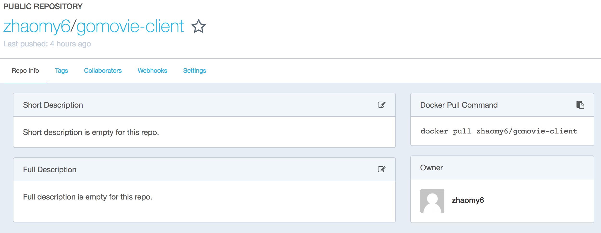

# 安装部署说明

本文档将详细说明最终制品后端的安装环境和步骤，安装成功的测试方法和常见问题的解决方法，请仔细阅读。

## 1 Client

由于已经为前端定制了放在 docker hub 上的公有镜像，因此配置过程可以变得异常简单。

### 1.1 安装环境

- 操作系统： `GNU Linux／mac OS／Windows`
- 安装依赖：`Docker`

### 1.2 配置与运行步骤

1. 安装 Docker。具体如何安装不属于本部署说明的范围内，可以参考[Docker官方网站](https://www.docker.com/)。

2. 从 Docker Hub 拷贝镜像。

   `docker pull zhaomy6/gomovie-client:v1`

3. 运行镜像，创建容器，这里注意需要将容器的8080端口暴露出来，才可以被宿主机器访问到。

   `docker run -p 8080:8080 -d zhaomy6/gomovie-client:v1`

4. 在浏览器中访问[前端项目地址](localhost:8080)。



### 1.3 常见问题

1. 无法在 localhost 访问。

   解决方案：查看是否做了容器的8080端口映射。或者删除并重新创建容器。

2. docker 镜像下载时间过长。

   解决方案：配置 docker 加速器。

3. 首页电影部分刷不出来

   解决方案：查看后端是否正常开启。


## 2 Server

### 2.1 安装环境

- 操作系统: `GNU Linux`
- 开发框架：`Spring`
- 数据库：`MySQL`
- 开发语言：`Java`

### 2.2 配置步骤

在运行该项目前请先完成安装环境的配置： 

1. 安装和配置所需要的数据库和设置。

```
sudo apt-get install mysql-server
```

注意安装过程会弹出提示框，输入root用户的密码，务必要记住这个密码，之后要在配置文件中填写。

2. 安装 maven

```
sudo apt-get install maven.
```

3. 安装 JDK

```
sudo apt-get update#check if Java is not already installed:java -version#Java Runtime Environment (JRE) Java Development Kit (JDK), sudo apt-get install default-jresudo apt-get install default-jdk
```

4. 安装redis

```
wget http://download.redis.io/redis-stable.tar.gztar xvzf redis-stable.tar.gzcd redis-stablemake
```

### 2.3 运行步骤

1. 下载项目：

```
git clone https://github.com/GoMovie/GoMovieServer.gitcd GoMovieServer-master/
```

2. 运行数据库

```
 mysql -u root -p mysql> create database GoMovie; mysql> use GoMovie;
```

3. 运行redis

```
cd redis-3.2.9/src/./redis-server
```

4. 运行后台，然后服务器就会运行在 `http://localhost:8080` 上。

```
cd GoMovieServer-master/mvn spring-boot:run
```

### 2.4 测试方法（要配合前端）

执行完以上运行步骤后，打开浏览器，访问 `http://localhost:8080`。

- 如果浏览器能正常加载前端页面，那么表示安装成功：
- 如果无法加载出页面，则安装失败，请检查以上步骤哪部执行出错，然后重新执行。

### 2.5 常见问题

1. 无法运行后端服务器，出现 build failure 错误

   解决方案：`rm -r ~/.m2/repository`，然后重新执行 


2. 成功执行全部步骤，但是无法加载出前端页面。

   解决方案：有可能正在维护，请一段时间后重新加载。