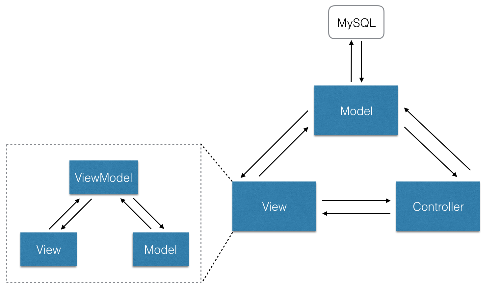

# SD — GoMovie Project

GoMovie 核心功能：

- 查询最近上映电影信息
- 电影购票
- 电影票转让

整体架构如下：


## 1. Client

GoMovie 项目的前端是一个电影订票 SPA。

项目代码组织如下：

```bash
.
├── build/                      # 配置webpack
│   └── ...
├── config/                     # 存放项目配置文件
│   ├── index.js                
│   └── ...
├── src/
│   ├── main.js                 # 应用入口
│   ├── url-config.js           # 存储了后端的地址
│   ├── App.vue                 # 应用根组件
│   ├── lib/                    # 一些通用的自定义函数库
│   ├── components/             # 页面中的可复用小部件
│   │   └── ...
│   ├── pages/                  # 主页面
│   │   └── ...
│   ├── store/                  # 引入vuex存储，作为全局状态树
│   │   ├── index.js
│   │   └── ...
│   └── assets/                 # 由webpack打包的静态资源
│       └── ...
├── static/                     # 不经过webpack打包的静态资源
├── test/
│   ├── e2e/                    # 配置端到端测试
│   └── unit/                   # 配置单元测试
├── .babelrc                    # babel设置
├── .postcssrc.js               # postcss设置
├── .eslintrc.js                # eslint设置
├── .editorconfig               # editor设置
├── .travis.yml                 # travis CI设置， 提供持续集成
├── index.html                  # 入口html
└── package.json                # 构建脚本以及依赖
```

### 1.1 技术选型

- 前端框架 Vue.js
  - 是一套构建用户界面的渐进式框架。与其他重量级框架不同的是，Vue 采用自底向上增量开发的设计。Vue 的核心库只关注视图层，因此易于上手。
  - MVVM 架构，模型、视图、视图模型三者的分离，减少各部件之间的耦合性，提高了开发效率。
- 前端组件库 ElementUI
  - 一套已经写好的 Vue 组件库。其中有很多通用性的组件，例如按钮、布局、输入框、表单等等，直接使用就不需要我们重新发明轮子，提高了开发的抽象级别和开发效率。
- 打包工具 Webpack
  - Webpack 是一个 Web 技术中的打包工具，可以整合各个文件的代码、图片、字体、样式表等等，将其压缩、丑化成一组文件，减少了这些资源在传输给用户时的时间损耗，也加强了对源代码的保密性。
- ES6 编译器 Babel 
  - 通过 Babel 工具，我们就可以编写 ES6 风格的 JavaScript，并且不用担心浏览器的支持问题，因为 Babel 可以将 ES6 编译成大多数浏览器都支持的 ES5 代码。
- 发送 ajax 请求 axios
  - 简单、轻量的 ajex 解决方案，让我们的前端应用可以很容易地向后端发送 ajex 请求。

### 1.2 架构设计

#### 1.2.1 整体架构

整个项目实现了 MVC 架构，而前端自身部分也实现了 MVVM 的架构，并且运行在与后端不同的服务器上，两者通过 REST API 进行信息交互，实现了前后端的完全分离。



#### 1.2.2 Story Board

为了更直观地体现前端在用户角度的交互过程，我们绘制了整个系统的 Story Board 用来呈现前端中涉及到的所有页面，以及页面之间的跳转关系，如下图所示：


### 1.3 模块划分

我们根据 Vue.js 的单文件组件以及路由，对页面元素进行了具有层次结构的划分，具体分为 *页面* 、*组件*、和提供支持的 *lib 函数*。此外还单独划分出了单元测试和端到端测试的模块。模块划分与项目中代码的对应关系如下图所示：


#### 1.3.1 页面

做页面设计的时候，我们参考在前一阶段所绘制出的 Story Board 作为参考，划分出了以下这些页面模块：

- cinema-info 选择电影院页面
- confirm-order 确认订单与付款页面
- home 主页
- movie-info 显示电影详细信息
- orders 查看用户订单页面
- seat-info 选座页面
- trade-board 提供电影票转让服务

我们将这些 *页面* 每一个都单独做成了一个 vue 组件，放在 `(project_root)/src/pages/` 下：


在每一个 *页面* 中，我们定义其组织结构、样式和操作逻辑（分别在`<template>` `<script>` 和 `<style>` 块中），并且，每一个 *页面* 又可以调用第一级别的 *组件* ，从而达到代码复用的效果。而用户又通过前端提供的路由，在输入不同 URL 时将对应的 *页面* 反馈给用户浏览器上显示。路由配置如下所示：

```javascript
export default [{
  path: '/',
  name: 'home',
  component: require('@/pages/home')
}, {
  path: '/cinema-info',
  component: require('@/pages/cinema-info')
}, {
  path: '/movie-info',
  component: require('@/pages/movie-info')
}, {
  path: '/confirm-order',
  component: require('@/pages/confirm-order')
}, {
  path: '/orders',
  component: require('@/pages/orders')
}, {
  path: '/seat-info',
  component: require('@/pages/seat-info')
}, {
  path: '/trade-board',
  component: require('@/pages/trade-board')
}]
```

#### 1.3.2 组件

在 GoMovie 项目中我们将 *页面* 所用到的组件放在 `(project_root)/src/components/` 目录下，并且将只有一个页面用到的组件放在了以该页面命名的文件夹下。


这里我们的很多组件其实只用到了一次，但是他们彼此之间以及与页面之间都是解耦的，只通过 props 和 event 的方式进行信息传递，每一个组件都可以被轻松扩展，并且可以被实现了相同接口的另一个组件所替代。这体现了高内聚低耦合的设计思路，提高了整个系统的可扩展和可维护性。

#### 1.3.3 lib 函数

项目中，自定义的通用的函数（与页面、组件等无关，比如日期、时间的计算等等），被统一放在了 `(project_root)/src/lib/` 下，为其他组件提供支持。

#### 1.3.4 测试模块

**单元测试：**主要关注组件的数据模型、方法的输入输出、组件间的数据传递情况和异步操作这四个方面。GoMovie 项目通过 karma 来进行单元测试。在 `(project_root)/test/unit/spec/` 目录下的不同文件中，进行断言编写。

**端到端测试：**端到端测试的方式通过测试模拟用户行为，打开浏览器自动化地做一些操作（如输入、点击等）看看程序是否能够达到预期等结果。Vue.js 可以使用 nightwatch 工具进行端到端测试。Nightwatch 是基于 NodeJS 的 e2e 测试框架，通过发送 HTTP 请求到 Selenium WebDriver 来控制浏览器进行测试

### 1.4 软件设计技术

#### 1.4.1 MVC / MV**

## 2. Server

### 2.1 技术选型
- Maven
  - Maven项目对象模型(POM)，可以通过一小段描述信息来管理项目的构建，报告和文档的软件项目管理工具
- redis
  - Redis有着更为复杂的数据结构并且提供对他们的原子性操作，这是一个不同于其他数据库的进化路径。Redis的数据类型都是基于基本数据结构的同时对程序员透明，无需进行额外的抽象
  - Redis运行在内存中但是可以持久化到磁盘,提供list，set，zset，hash等数据结构的存储
- DAO
  - DAO(Data Access Object)是一个数据访问接口,使用数据访问对象（DAO）设计模式把底层的数据访问逻辑和高层的商务逻辑分开.实现DAO模式能够更加专注于编写数据访问代码
- Spring Boot
  - Spring Boot使用“约定优先配置”（convention over configuration）的思想来摆脱Spring框架中各类繁复纷杂的配置，它可以快速、敏捷地开发新一代基于Spring框架的应用程序，集成了大量常用的第三方库配置，只需要非常少量的配置代码，开发者能够更加专注于业务逻辑。基于此，我们选用spring boot框架来快速、敏捷地开发后端。
  - 首先需要在`pom.xml`中引入spring boot的开发依赖：
```java
<parent>
        <groupId>org.springframework.boot</groupId>
        <artifactId>spring-boot-starter-parent</artifactId>
        <version>1.3.5.RELEASE</version>
    </parent>

    <dependencies>
        <dependency>
            <groupId>org.springframework.boot</groupId>
            <artifactId>spring-boot-starter-web</artifactId>
        </dependency>
    ...
```
  编写类处理HTTP请求方法及main函数即可启动Tomcat容器，在`Application.jaca`的`SpiringApplication.run()`方法执行后，在内嵌的Tomcat容器中启动spring的应用上下文：
```java
package com.c09.GoMovie;
import org.springframework.boot.SpringApplication;
import org.springframework.boot.autoconfigure.SpringBootApplication;
import org.springframework.cache.annotation.EnableCaching;

//@EnableAdminServer
@EnableCaching
@SpringBootApplication
public class Application {

    public static void main(String[] args) {
        SpringApplication.run(Application.class, args);
    }
}
```
编写类处理HTTP请求方法及main函数即可启动Tomcat容器，在`Application.jaca`的`SpiringApplication.run()`方法执行后，在内嵌的Tomcat容器中启动spring的应用上下文：
```java
package com.c09.GoMovie;
import org.springframework.boot.SpringApplication;
import org.springframework.boot.autoconfigure.SpringBootApplication;
import org.springframework.cache.annotation.EnableCaching;

//@EnableAdminServer
@EnableCaching
@SpringBootApplication
public class Application {

    public static void main(String[] args) {
        SpringApplication.run(Application.class, args);
    }
}
```
如果要更改默认配置，在`application.yml`文件中修改即可

- Spring MVC
  - spring mvc框架处理web请求的基本流程如下图所示，请求通过Tomcat Filter，经过Dispatcher Servlet分发调度后，按照顺序经过一系列的Handler Interceptors并且执行其中的预处理方法，提交给controller，经Business Service Facade处理后原路返回并进行一些后处理。
  


- Spring Data JPA
  - Spring Boot它具有自动配置Spring Data以访问数据库的能力。只需将spring-boot-starter-data-jpa包含进来，Boot的自动配置引擎就能探测到程需要数据访问功能，并且会在Spring应用上下文中创建必要的Bean，以供开发者使用Repository和服务
  - 对于每个实体，以cinema为例，在`cinema.java`中，用`@GeneratedValue(strategy=GenerationType.AUTO)` ——JPA注唯一标识符id，这样就将这个cinema对象转化为了关系型数据库中的记录：
```java
@Entity
public class Cinema {
  
  @Id
  @GeneratedValue(strategy=GenerationType.AUTO)
  private long id;
  ...
```
在`userRepository.java`中就能够自动创建数据访问对象的实现：
```
package com.c09.GoMovie.cinema.entities.repositories;
import java.util.List;
import org.springframework.data.jpa.repository.JpaRepository;
import org.springframework.data.repository.CrudRepository;
import com.c09.GoMovie.cinema.entities.Cinema;
import com.c09.GoMovie.cinema.entities.CinemaComment;

public interface CinemaRepository extends JpaRepository<Cinema, Long> {
  List<Cinema> findByCityId(String cityId);
}
```
