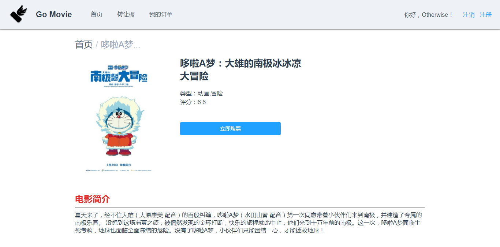
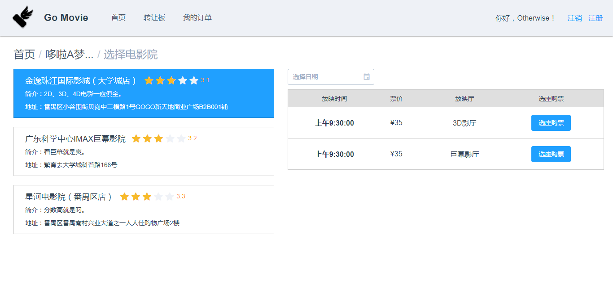
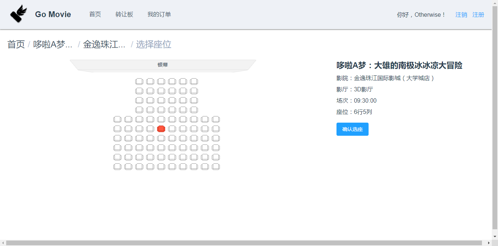
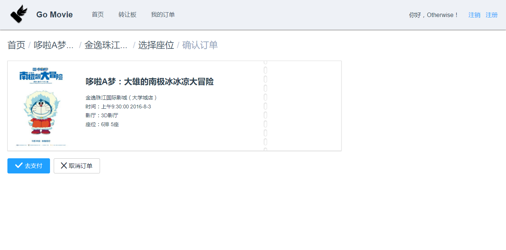
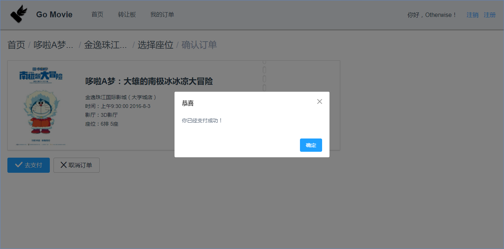
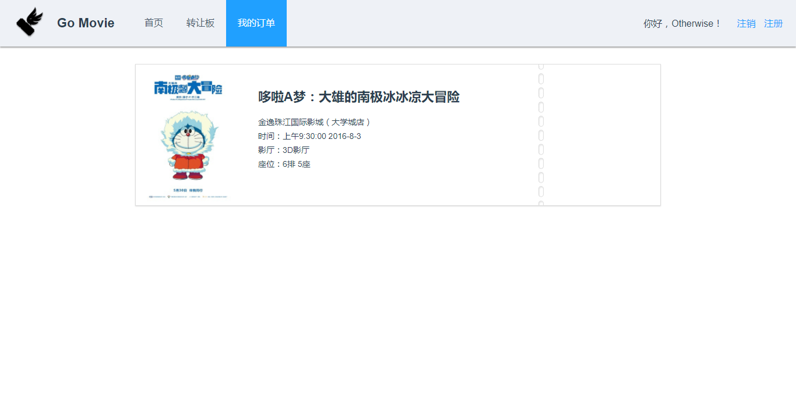
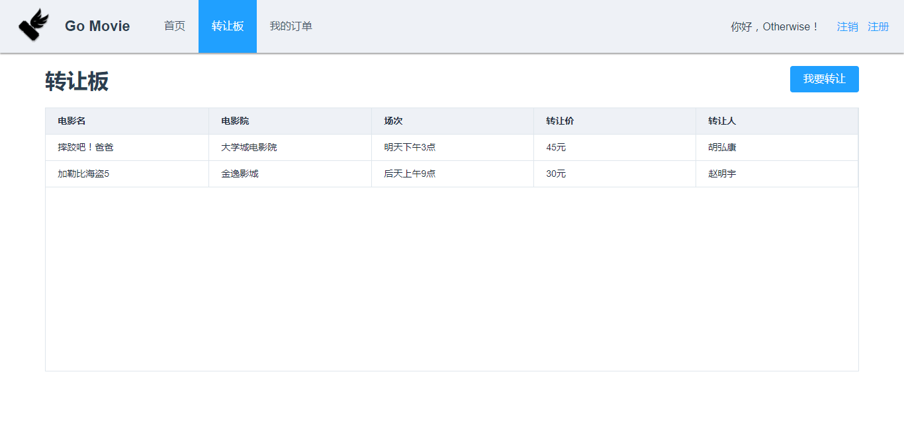
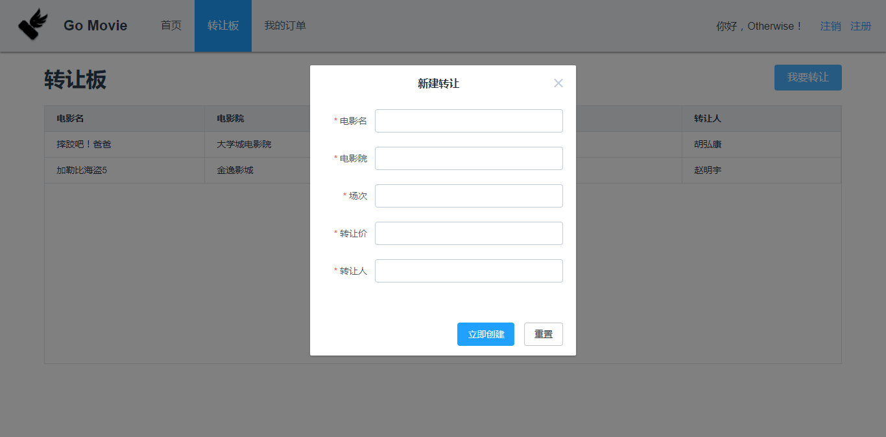

# GoMovie用户手册

## 一、引言

### 1.1编写目的

​	GoMovie是一个新生的电影购票与影视服务网站，基于原有购票系统进行简化，并在市场原有相关功能上新增影票转让功能以增加用户粘性。此用户手册适用于使用GoMovie网站进行购票等相关服务的人群。


### 1.2项目背景

​	现有电影购票与影视服务网站的页面有时候太过繁琐，没有把焦点聚集在购票业务上，GoMovie电影购票系统是一个简洁的轻量级的购票系统，有助于用户以最快的速度完成购票的流程。

​	此外，根据GoMovie团队做出的市场调研，发现大多数用户都存在临时有事需要转让影票的情况，但是转让的方式各式各样且效率比较低(比如朋友圈转让，QQ空间转让等)，GoMovie电影购票系统新增了一个“转让板“的功能，给用户提供一个集中转让的方式，既满足需要转让影票的用户的需求，同时也满足想要购票的用户的需求，是一个”双赢“的选择。

​	GoMovie系统由中山大学数据科学与计算机学院6名大三学生负责前端与后端的完整的系统的开发。

---

## 二、软件概述

### 2.1目标

​	GoMovie电影购票系统在传统的购票系统的基础上新增了”转让板“的功能，在我们购票后，随时可能会出现临时改变主意或者意外买错影票(错误的场次/影院/电影等)的情况，而没办法去电影院观影，但是现在的影院都拒绝提供退票的服务，而我们采取的方式是通过微信或者QQ等社交软件进行转发求转让的行动，效率比较低，所以我们的GoMovie提供了”转让版“的功能，让转让影票的用户都可以集中起来，方便转让，同时也方便其他用户的购买。

​	GoMovie的主要目标用户除了传统购票用户之外，还锁定了比较喜欢轻量级，简洁的服务的用户。


### 2.2功能

​	GoMovie电影购票系统运行在Web端，购票用户可以根据电影的评分和描述决定是否观看此部电影，页面简洁高效。

​	同时，提供的”转让板“转让影票服务，即在购票系统中设立的一个转让影票的专区，转让方可以直接设置不高于原价的出售价格，提供给尚未购票的用户进行购买。


### 2.3性能

​	GoMovie购票平台利用了一个创新型的转让影票功能以及简洁清新的界面吸引更多的用户选择。转让影票虽然不是刚需，却是一种经常会出现的情况，是值得重视也值得集成到同一个平台进行转让的，可以提高转让影票的效率也可以提高购买影票的效率，一举两得。

---

## 三、运行环境

### 3.1后端

- Spring Web框架
- MySQL关系型数据库
- Redis缓存技术
- Junit集成与测试工具


### 3.2前端

- 框架Vue.js
- 打包工具Webpack
- ES6编译器Babel
- 发送Ajax请求axios

---

### 四、GoMovie用户交互界面

1. 主界面

   

2. 选择某部电影之后的电影简介以及电影评分界面

   

3. 选择场次界面

   

4. 选择座位界面

   

5. 支付订单界面

   

6. 支付成功界面

   

7. 查看”我的订单“界面

   

8. ”转让板“界面

   

9. 新建”转让影票“界面

   

---

## 五、程序文件一览表

### 5.1前端目录结构

```bash
.
├── build/                      # 配置webpack
│   └── ...
├── config/                     # 存放项目配置文件
│   ├── index.js                
│   └── ...
├── src/
│   ├── main.js                 # 应用入口
│   ├── url-config.js           # 存储了后端的地址
│   ├── App.vue                 # 应用根组件
│   ├── lib/                    # 一些通用的自定义函数库
│   ├── components/             # 页面中的可复用小部件
│   │   └── ...
│   ├── pages/                  # 主页面
│   │   └── ...
│   ├── store/                  # 引入vuex存储，作为全局状态树
│   │   ├── index.js
│   │   └── ...
│   └── assets/                 # 由webpack打包的静态资源
│       └── ...
├── static/                     # 不经过webpack打包的静态资源
├── test/
│   ├── e2e/                    # 配置端到端测试
│   └── unit/                   # 配置单元测试
├── .babelrc                    # babel设置
├── .postcssrc.js               # postcss设置
├── .eslintrc.js                # eslint设置
├── .editorconfig               # editor设置
├── .travis.yml                 # travis CI设置， 提供持续集成
├── index.html                  # 入口html
└── package.json                # 构建脚本以及依赖
```


### 5.2后端目录结构

```bash
​```
  ├─logs                                     # tomcat access log
  ├─src
  │  ├─main
  │  │  ├─java
  │  │  │  └─com
  │  │  │      └─c09
  │  │  │          └─GoMovie
  │  │  │              ├─config              # 配置类
  │  │  │              ├─movie
  │  │  │              │  ├─controller       # 控制器
  │  │  │              │  ├─entities         # 实体层
  │  │  │              │  │  └─repositories  # DAO 层
  │  │  │              │  └─service          # 服务层
  │  │  │              ├─helper
  │  │  │              └─user
  │  │  │                  ├─controller      # 控制器
  │  │  │                  ├─entities        # 实体层
  │  │  │                  │  └─repositories # DAO 层
  │  │  │                  └─service         # 服务层
  │  │  └─resources                          # 资源定义文件
  │  │      └─config
  │  └─test                                  # 单元测试类
  │      └─java
  │          └─com
  │              └─c09
  │                  └─GoMovie
  ├─pom.xml                                  # 包依赖
  |
  |...
​```
```

